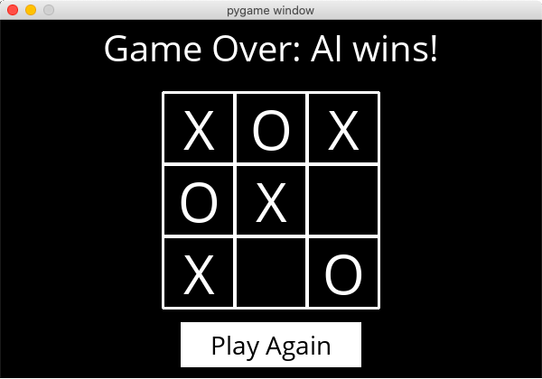

# tictactoeAI
Test your Tic-Tac-Toe abilities against a computer!

<p align="center">
  
<p>
  
## Intro
Play a game of Tic-Tac-Toe against a machine! The computer will use an Artificial Intelligence algorithm to make the best move, so don´t be surprised if you can´t do better than a tie!

## How to run it

- ### **Requirements**

  - [Python 3.x](https://www.python.org/downloads/)
  - [pygame](https://www.pygame.org/)
  
1. Clone this repository:

```sh
  $ git clone https://github.com/Alessandro1918/tictactoeAI
```

2. Install the required libs:
```sh
  $ cd tictactoeAI
  $ pip3 install -r requirements.txt
```

3. Run:

```sh
  $ python3 runner.py
```
